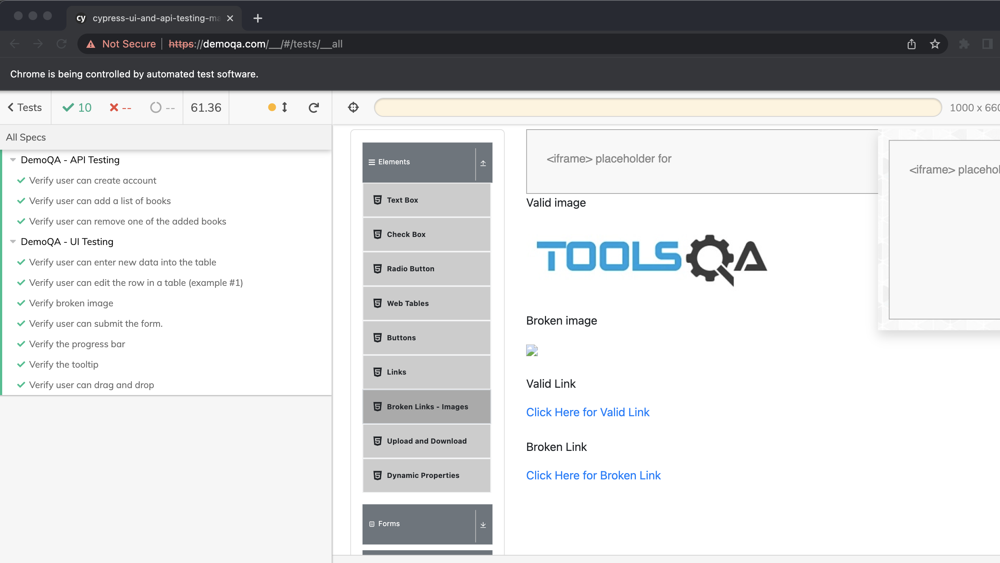
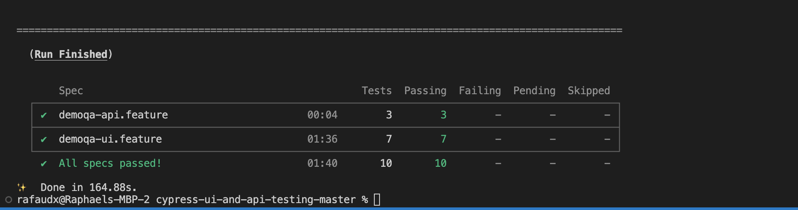

# Test Automation Assignment using Cypress/Typescript with cucumber framework

Cypress is a node.js tool to automate the UI/API of a web application.

TypeScript is a strongly typed programming language that builds on JavaScript, giving you better tooling at any scale.

Cucumber is a testing tool that supports Behavior Driven Development (BDD) and offers a way to write tests that anybody can understand, regardless of their technical knowledge.

## Installation

If yarn is not installed install yarn by: `npm i -g yarn`

Then install all packages by doing a `yarn install`

## Assumptions

> All tests will be performed on DemoQA.COM
> Page object pattern will be used without using xpath

## UI Tasks
Create UI automated tests using the DEMO-QA Platform

1. [x] TC01- Scenario A - Verify user can enter new data into the table
2. [x] TC01- Scenario B - Verify user can edit the row in a table
3. [x] TC02 - Verify broken image
4. [x] TC03 - Verify user can submit the form
5. [x] TC04 - Verify the progress bar
6. [x] TC05 - Verify the tooltip
7. [x] TC06 - Verify user can drag and drop

## API Tasks
Create API automated tests using the DEMO-QA Platform

8. [x] Creation of user account
9. [x] Add a list of books for the created user
10. [x] Remove one of the added books

## Testing

   - **Framework overview**
     > Framework uses Cypress and Typescript for UI & API testing
     > Framework files can be found under `cypress/integration` folder
     > Framework uses BDD approach (cucumber) for test design
     > Tests are written in feature files which have a corresponding folder (with same name) containing test files/steps
     > Framework uses a page object design pattern (for the UI test)
   - **Steps to run**
     > Complete the steps in the installation column above
     > Run command in root folder: `yarn cypress open`
     > When Cypress app opens, to run test for a single feature file, click on test name e.g. demoqa-ui.feature (to run UI tests) or demoqa-api.feature (to run api tests). Or click on "Run 2 integration specs" to run all tests
   - **Another way to run**
     > Run command in root folder: `yarn cypress run`
     > Cypress runs all tests in headless mode and prints result to terminal
       - **UI Test result**
       
       - **UI and API Test result**
       

